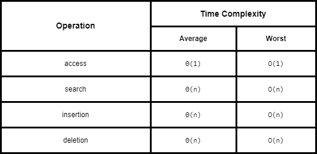

# Arrays

Python has various "sequence" classes, namely the built in **list**, **tuple** and **str** classes. They have significant commonality, most notably that:

1. each supports indexing to access an individual elements of a sequence using a syntax such as `seq[k]`
2. each uses a low-level concept known as an **array** to represent the sequence

However they also have significant differences in the abstractions that these classes represent, and in the way instances of these classes are represented internally by Python.

## Low-Level Arrays

The primary memory of a computer is composed of bits of information, and those bits are typically grouped into larger units that depend upon the precise system architecture. Such a typical unit is a **byte**, which is equivalent to 8 bits.

To keep track of what information is stored in what byte, the computer uses an abstraction known as a **memory address** - each byte of memory is associated wih a unique number that serves as its address (more formally, the binary representation of the number servers as the address).

Even thought the bytes are physically stored sequentially, **Random Access Memory** can store and retrieve in `O(1)` time.

A group of related variables can be stored one after another in a contiguous portion of the computer's memory - denoted as an **array**. An example is a text string where each character is represented using the Unicode Character set with 16 bits (i.e. 2 bytes) for each character. So a siz-character string, such as 'SAMPLE' is stored in 12 consecutive bytes of memory.

Hence each cell of an array must use the same number of bytes to allow an arbitrary cell of the array to be accessed in constant time based on its index.

## Referential Arrays

Imagine an array of 200 strings - these strings can be of any length. So one way to store this would be to reserve enough space for each cell to hold the **maximum** length string but that would be wasteful. So instead we store the **reference** of each cell's object - i.e. memory addresses at which the elements of the sequence reside.

In such a scenario:

1. a single list may include multiple references to the same object as elements of the list
2. it is possible for a single object to be an element of two or more lists

When elements are immutable, this is not a huge issue, as neither of the lists can cause a change to the shared object. e.g. `temp[2] = 15` just changes the reference of the indexed cell to the new object `15`.

More care is needed when we are dealing with mutable objects.

## Compact Array

Strings are for example represented using an array of characters (not an array of references) - i.e. a **compact array** because the array is storing the bits that represent the primary data.

These have some advantages over referential structures in terms of computing performance:

1. overall memory usage will be much lower for a compact structure because there is no overhead devoted to the explicit storage of the sequence of memory references in addition to the primary data
2. the primary data are stored consecutively in memory - which is not the case for a referential structure. Because of the workings of the cache and memory hierarchies of computers, it is often advantageous to have data stored in memory near other data that might be used in the same computations.

Primary support for compact arrays is in a module named `array`.

## Dynamic Arrays and Amortization

When creating a low-level array in a computer system, the precise size of that array must be explicitly declared in order for the system o properly allocate a consecutive piece of memory for its storage. Because the system may dedicate neighboring memory locations to store other data, the capacity of an array cannot trivially be increased by expanding into subsequent cells.

- for `tuple` or `str` this is not a problem - they are immutable, so the correct size for an underlying array can be fixed when the object is instantiated

However `list` class allows us to add elements tot he list with no apparent limit to the overall capacity of the list - this is accomplished through an algorithmic implementation of a **dynamic array**.

The key properties that allow this are:

1. the list instance maintains an underlying array that is often larger / has greater capacity than the current length of the list - the system may reserve an underlying array capable of storing more object references than what the list was instantiated with
2. as new elements are appended to a list, the class requests new larger arrays from the system and initialize the new array so that its prefix matches that of the existing small array - at which point the old array is reclaimed by the system

#### Implementing a Dynamic Array

```python
import ctypes

class DynamicArray:
    """
    A dynamic array class akin to a simplified Python list.
    """

    def __init__(self):
        """Create an empty array"""
        # count actual elements
        self._n = 0
        # default array capacity
        self._capacity = 1
        # low-level array
        self._A = self._make_array(self._capacity)

    def __len__(self):
        """Return number of elements stored in the array."""
        return self._n

    def __get_item(self, k):
        """Return element at index k."""
        if not 0 <= k < self._n:
            raise IndexError('invalid index')
        # retrieve from array
        return self._A[k]

    def append(self, obj):
        """Add an object to the end of the array"""

        # if there is not enough room
        if self._n == self._capacity:
            # double the capacity
            self._resize(2 * self._capacity)

        self._A[self._n] = obj
        self._n += 1

    def insert(self, k, obj):
        """Insert value at index k, shifting subsequent values rightward"""

        # we assume that k is 0 <= k <= n
        if self._n == self._capacity:
            # not enough room
            self._resize(2 * self._capacity)

        for j in range(self._n, k, -1):
            # shift rightmost first
            self._A[j] = self._A[j-1]

        # store newest element
        self._A[k] = obj
        self._n += 1

    def remove(self, k, obj):
        """Remove value at index k, shifting subsequent values leftward"""

        # we don't consider shrinking the dynamic array in this implementation
        for k in range(self._n):
            if self._A[k] == obj:
                # found the object
                for j in range(k, self._n - 1):
                    # shift other values to fill the gap
                    self._A[j] = self._A[j+1]
                # garbage collection
                self._A[self._n - 1] = None
                # have one less item
                self._n -= 1
                return

        raise ValueError('object / value not found')


    def _resize(self, c):
        """Resize internal array to capacity c"""

        # create new array
        B = self._make_array(c)

        # copy all existing values to new array
        for k in range(self._n):
            B[k] = self._A[k]

        self._A = B
        self._capacity = c

    def _make_array(self, c):
        """Return new array with capacity c"""

        return (c * ctypes.py_object)()
```

#### Amortized Analysis of Dynamic Arrays

It may seem that replacing an array with a new larger array might seem slow (because a single append operation may require O(n) time to perform), however notice that by doubling the capacity during an array replacement the new array allows us to add `n` new elements before the array must be replaced again.

Therefore performing a series of operations on an initially empty dynamic array is efficient in terms of its total running time (or **amortized** time).

So the amortized bound of appending items to a list can be shown to be `O(1)` - and this is also true for any geometrically increasing progression of array sizes.

But arithmetic progression (i.e. a constant increase in cells of a dynamic array) does not perform as well - in fact it causes the append operation to be quadratic to the number of operations.

Also geometric increase in capacity for dynamic arrays guarantees that the final array size is proportional to the overall number of elements - i.e. the data structure uses O(n) memory. However some considerations need to be made if repeated insertions and removals from the array are possible.

## Efficiencies

Space Complexity: `O(n)`

Time Complexities:



## Pythonic Code Notes

1. Extending a list - use `extend` instead of `append` when adding multiple new entries in an array. This is because `extend` will pre-compute the amount of resizing needed for the new data in advance.

2. Constructing new lists - use **list comprehensions** instead of `append` - again due to similar reasons as above. However be careful in how the objects are referenced:

```python
# this will create a reference to the same [0, 0] list!
incorrect_2d_array = [[0] * 2] * 5
# this will create reference to independent [0, 0] lists
correct_2d_array = [[0] * 2 for j in range(5)]

incorrect_2d_array[0][0] = 100
correct_2d_array[0][0] = 100

print(f"Incorrect 2D array: {incorrect_2d_array}")
print(f"Correct 2D array: {correct_2d_array}")

```

    Incorrect 2D array: [[100, 0], [100, 0], [100, 0], [100, 0], [100, 0]]
    Correct 2D array: [[100, 0], [0, 0], [0, 0], [0, 0], [0, 0]]
