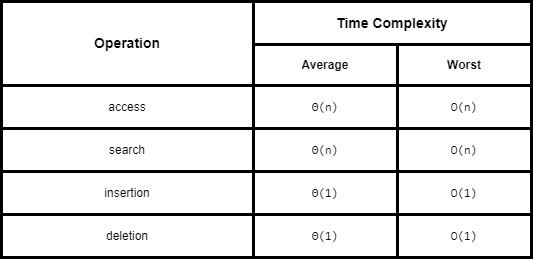

# Dequeue - Double-Ended Queues

A queue like data structure that supports insertion and deletion from both the front and back of the queue.

An implementation of this is available through the `deque` class in Python in the standard collections module.

## Array-Based Deqeue Implementation

We can implement a deque in a similar way as the [Queue](./queues.md). The main modifications are:

1. adding a pointer to the last element as `.last()` where `last = (self._front + self._size - 1) % len(self._data)`
2. ability to add and remove from the back of the queue

```python
class Empty(Exception):
    """Error attempting to access an element from an empty container."""
    pass

class ArrayQueue:
    """FIFO queue implementation using list"""

    DEFAULT_CAPACITY = 10

    def __init__(self):
        self._data = [None] * ArrayQueue.DEFAULT_CAPACITY
        self._size = 0
        self._front = 0

    def __len__(self):
        return self._size

    def is_empty(self):
        return self._size == 0

    def first(self):
        if self.is_empty():
            raise Empty('Queue is Empty')

        return self._data[self._front]

    def last(self):
        if self.is_empty():
            raise Empty('Queue is Empty')

        back = (self._front + self._size - 1) % len(self._data)

        return back

    def add_first(self, e):
        if self._size == len(self._data):
            self._resize(2 * len(self.data))

        self._front = (self._front - 1) % len(self._data)
        self._data[self._front] = e
        self._size += 1

    def delete_first(self):
        if self.is_empty():
            raise Empty('Deque is Empty')

        answer = self._data[self._front]

        self._data[self._front] = None
        self._front = (self._front + 1) % len(self._data)
        self._size -= 1

        if 0 < self._size < len(self._data) // 4:
            self._resize(len(self._data) // 2)

        return answer

    def add_last(self, e):
        if self._size == len(self._data):
            self._resize(2 * len(self.data))

        avail = (self._front + self._size) % len(self._data)
        self._data[avail] = e
        self._size += 1

    def delete_last(self):
        if self.is_empty():
            raise Empty('Deque is empty')

        back = self.last()
        answer = self._data[back]
        self._data[back] = None
        self._size -= 1

        if 0 < self._size < len(self._data) // 4:
            self._resize(len(self._data) // 2)

        return answer

    def _resize(self, cap):
        old = self._data
        self._data = [None] * cap
        walk = self._front

        for k in range(self._size):
            self._data[k] = old[walk]
            walk = (1 + walk) % len(old)

        self._front = 0
```

## Efficiencies

Space Complexity: `O(n)`

Time Complexities:


