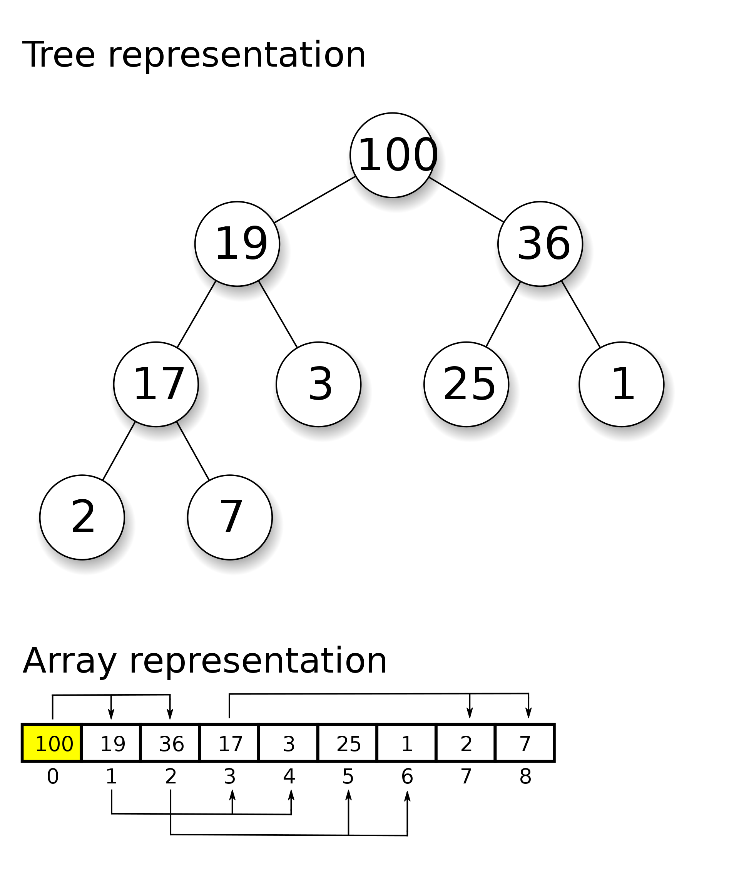

# Priority Queues and Heaps
A collection of prioritized elements that allow arbitrary element insertion, and allows the removal of the elmenet that has first priority. Priority is provided by an associated **key** - and the element with the *minimum* key will be the next to be removed from the queue. The key must define a natural order i.e. `a < b` for any instance `a` and `b`. 

## Priority Queue ADT

```python
from abc import ABC, abstractmethod

class PriorityQueueBase:
    class _Item:
        __slots__ = '_key', '_value'

        def __init__(self, k, v):
            self._key = k
            self._value = v

        def __lt__(self, other):
            return self._key < other._key

        def __repr__(self):
            return '({0},{1})'.format(self._key, self._value)

    def is_empty(self):
        return len(self) == 0

    def __len__(self):
        raise NotImplementedError('must be implemented by subclass')

    @abstractmethod
    def add(self, key, value):
        raise NotImplementedError('must be implemented by subclass')

    @abstractmethod
    def min(self):
        raise NotImplementedError('must be implemented by subclass')

    @abstractmethod
    def remove_min(self):
        raise NotImplementedError('must be implemented by subclass')
```

### Implementation with Unsorted List

In this we store entries within an unsorted list using a doubly-linked list (`PositionalList`) defined from [](../Data%20Structures/positional%20list.md##position%20abstraction)

The doubly linked list ensures all of the operations execute in `O(1)` time except for `min` and `_find_min` which would take `O(n)`

```python
class UnsortedPriorityQueue(PriorityQueueBase):
    def _find_min(self):
        if self.is_empty():
            raise Empty('Priority queue is empty')
        small = self._data.first()
        walk = self._data.after(small)
        while walk is not None:
            if walk.element() < small.element():
                small = walk
            walk = self._data.after(walk)
        return small

    def __init__(self):
        self._data = PositionalList()

    def __len__(self):
        return len(self._data)

    def add(self, key, value):
        self._data.add_last(self._Item(key, value))

    def min(self):
        p = self._find_min()
        item = p.element()
        return (item._key, item._value)

    def remove_min(self):
        p = self._find_min()
        item = self._data.delete(p)
        return (item._key, item._value)
```

### Implementation with a Sorted List
A alternative is to use a positional list but maintaining the entries sorted by non-decreasing keys. But in this case the insertion of a new entry has a cost of `O(n)` using insertion sort.

But `min` and `remove_min` take oly `O(1)` time now.

```python
class SortedPriorityQueue(PriorityQueueBase):
    def __init__(self):
        self._data = PositionalList()

    def __len__(self):
        return len(self._data)

    def add(self, key, value):
        newest = self._Item(key, value)
        walk = self._data.last()
        while walk is not None and newest < walk.element():
            walk = self._data.before(walk)
        if walk is None:
            self._data.add_first(newest)
        else:
            self._data.add_after(walk, newest)

    def min(self):
        if self.is_empty():
            raise Empty('Priority queue is empty.')
        p = self._data.first()
        item = p.element()
        return (item._key, item._value)

    def remove_min(self):
        if self.is_empty():
            raise Empty('Priority queue is empty.')
        item = self._data.delete(self._data.first())
        return (item._key, item._value)
```

## Heaps

A data structure that provides an efficient realization of a priority queue - both insertions and removals are in logarithmic time - which is a significant improvement over the list based implementations.

A **binary heap** uses a **binary tree** which helps find a compromise between elements being entirely unsorted and perfectly sorted.

In python this is implemented as a `heapq`.

### Properties

- Stores a collection of items at its positions
- **Heap Order Property** - for every position `p` other than the root, the key stored at `p` is greater than or equal to the key stored at `p's` parent
    - Point 2. means that the minimum key is always stored at the root of the heap. Keys encountered on a path from the root to the leaf of a heap are in nondecreasing order.
- **Complete Binary Tree Property** - a heap with height `h` is [**complete**](../Data%20Structures/trees.md#complete)
- **Height of a Heap** - given that it is complete, `height h = floor(log n)`
 
<figure markdown="span">
{loading=lazy : style="width:400px"}
</figure>

### Array based representation
The **array-based representation** of the complete binary tree are based on the properties:

1. If `p` is the root of `T` then `f(p) = 0`
2. If `p` is the left child of position `q`, then `f(p) = 2f(q) + 1`
3. If `p` is the right child of position `q`, then `f(p) = 2f(q) + 2`

With this implementation, the last position of the heap is always at index `n-1`, where n is the number of positions of `T`. This reduces the complexities of a node-based tree structure and heap operations (e.g. locating the last position of a complete binary tree).

### Implementation
Operations on a heap need to maintain its **complete binary tree properties**.

Key operations of a heap:

1. **add(k,v)** - adding a key, value pair at position `p` just beyond the right most node, and then `up-heap bubbling` to maintain **heap-order property**
2. **remove_min()** - remove and return (k,v) tuple with minimum keyalong with `down-heap bubbling` after removal.

#### Up-Heap Bubbling


Once a new `(k,v)` pair has been added to the rightmost node at the bottom level (or new level) of the tree, a comparison of the key at position `p` to that of the parent of `p` is done until heap-order property is satisfied. 

Worst case scenario, a new entry moves all the way to the root of the heap with a bound of `floor(log(n))`.

#### Down-Heap Bubbling


When the minimumn is removed as a root of the tree, the leaf at the **last** position of the tree is copied to the root, and the node at the last position is deleted.

If the heap has more than one node (the root) then we identify two cases where `p` initially denotes the root of the tree `T`:

- if `p` has no right child, let `c` be the left child of `p`
- other (`p` has both children) then let `c` be a child of `p` with minimal key

Until $k_p > k_c$ swap the entries stored at `p` and `c` until the heap-order property is satisfied for both `p` and all of `c`. This means that even though the heap-order property may be locally restored for node `p` relative to its children, there may be a violation of this property at `c`, hence we have to continue swapping down `T` until no violation of the heap-order property occurs.

#### Python Implementation
```python
class HeapPriorityQueue(PriorityQueueBase):

  def __init__(self):
    self._data = []
 
  def _parent(self, j):
    return (j-1) // 2

  def _left(self, j):
    return 2*j + 1
  
  def _right(self, j):
    return 2*j + 2

  def _has_left(self, j):
    return self._left(j) < len(self._data)
  
  def _has_right(self, j):
    return self._right(j) < len(self._data)
  
  def _swap(self, i, j):
    self._data[i], self._data[j] = self._data[j], self._data[i]

  def _upheap(self, j):
    parent = self._parent(j)
    if j > 0 and self._data[j] < self._data[parent]:
      self._swap(j, parent)
      self._upheap(parent)
  
  def _downheap(self, j):
    if self._has_left(j):
      left = self._left(j)
      small_child = left
      if self._has_right(j):
        right = self._right(j)
        if self._data[right] < self._data[left]:
          small_child = right
      if self._data[small_child] < self._data[j]:
        self._swap(j, small_child)
        self._downheap(small_child)

  def __len__(self):
    return len(self._data)

  def add(self, key, value):
    self._data.append(self._Item(key, value))
    self._upheap(len(self._data) - 1)
  
  def min(self):
    if self.is_empty():
      raise Empty('Priority queue is empty.')
    item = self._data[0]
    return (item._key, item._value)

  def remove_min(self):
    if self.is_empty():
      raise Empty('Priority queue is empty.')
    self._swap(0, len(self._data) - 1)
    item = self._data.pop()
    self._downheap(0)
    return (item._key, item._value)
```

## Applications

### Sorting
- Selction Sort
- Insertion Sort
- Heap Sort

## Adaptable Priority Queues
Adaptable priority queues extends the base implementation to additional methods:

- **remove(loc)** ability to remove any node (not just the min) from the heap
- **update(loc, k, v)** ability to modify the priority of an existing node

To support this we will implement a **locator** - similar to [`Position`](./positional%20list.md) but with one major difference - locator does not represent a tangible placement of an element within the structure.

```python
class AdaptableHeapPriorityQueue(HeapPriorityQueue):
  """A locator-based priority queue implemented with a binary heap."""

  #------------------------------ nested Locator class ------------------------------
  class Locator(HeapPriorityQueue._Item):
    """Token for locating an entry of the priority queue."""
    __slots__ = '_index'                 # add index as additional field

    def __init__(self, k, v, j):
      super().__init__(k,v)
      self._index = j

  #------------------------------ nonpublic behaviors ------------------------------
  # override swap to record new indices
  def _swap(self, i, j):
    super()._swap(i,j)                   # perform the swap
    self._data[i]._index = i             # reset locator index (post-swap)
    self._data[j]._index = j             # reset locator index (post-swap)

  def _bubble(self, j):
    if j > 0 and self._data[j] < self._data[self._parent(j)]:
      self._upheap(j)
    else:
      self._downheap(j)

  #------------------------------ public behaviors ------------------------------
  def add(self, key, value):
    """Add a key-value pair."""
    token = self.Locator(key, value, len(self._data)) # initiaize locator index
    self._data.append(token)
    self._upheap(len(self._data) - 1)
    return token

  def update(self, loc, newkey, newval):
    """Update the key and value for the entry identified by Locator loc."""
    j = loc._index
    if not (0 <= j < len(self) and self._data[j] is loc):
      raise ValueError('Invalid locator')
    loc._key = newkey
    loc._value = newval
    self._bubble(j)

  def remove(self, loc):
    """Remove and return the (k,v) pair identified by Locator loc."""
    j = loc._index
    if not (0 <= j < len(self) and self._data[j] is loc):
      raise ValueError('Invalid locator')
    if j == len(self) - 1:                # item at last position
      self._data.pop()                    # just remove it
    else:
      self._swap(j, len(self)-1)          # swap item to the last position
      self._data.pop()                    # remove it from the list
      self._bubble(j)                     # fix item displaced by the swap
    return (loc._key, loc._value)             
```