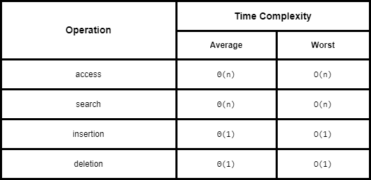

# Queues and Deques

## Queues

A `queue` is a collection of objects that are inserted and removed according to the `first-in, first-out (FIFO)` principle. Elements can be inserted at any time, but only the elements that has been in the queue the longest can be next removed.

Some common methods supported by a queue are:

- `queue.enqueue(e)` - add an element `e` to the back of a queue
- `queue.dequeue()` - remove and return the first element from a stack
- `queue.first()` - return the first element of a stack
- `queue.is_empty()` - check if queue is empty
- `len(queue)` - the number of elements in a queue

### Array-Based Queue Implementation

Utilizing a `list` for a queue would be very inefficient - this is because `pop(0)` i.e. a `pop` on a non-default index causes a loop to be executed that shifts all elements beyon the index to te left. This would cause the worst-case behavior of O(n) time.

Therefore we need to implement a queue using a **circular array** with the following logic:

1. initialize a `list` with a fixed size that is larger than the actual number of elements t be ever added tot he queue
2. define `front` as the index of the "first" element of a queue
3. enqueue items to the index calculated by `(front + size) % capacity` of the queue
   - for example for a queue of size 3, enqueue of [2, 1, 4] would be built as following: [2, None, None] -> [2, 1, None] -> [2, 1, 4]
   - then following dequeue operations will happen like so: [None, 1, 4] and front = 1 -> [None, None, 4] and front = 2 etc.
4. whenever the size of the queue is equal to its capacity, resize it to be double the capacity, and whenever the size is 1/4th of the capacity, resize it to be half the capacity

```python
class Empty(Exception):
    """Error attempting to access an element from an empty container."""
    pass

class ArrayQueue:
    """FIFO queue implementation using list"""

    DEFAULT_CAPACITY = 10

    def __init__(self):
        self._data = [None] * ArrayQueue.DEFAULT_CAPACITY
        self._size = 0
        self._front = 0

    def __len__(self):
        return self._size

    def is_empty(self):
        return self._size == 0

    def first(self):
        if self.is_empty():
            raise Empty('Queue is Empty')

        return self._data[self._front]

    def dequeue(self):
        if self._is_empty():
            raise Empty('Queue is Empty')

        answer = self._data[self._front]

        self._data[self._front] = None
        self._front = (self._front + 1) % len(self._data)
        self._size -= 1

        if 0 < self._size < len(self._data) // 4:
            self._resize(len(self._data) // 2)

        return answer

    def enqueue(self, e):
        if self._size == len(self._data):
            self._resize(2 * len(self.data))

        avail = (self._front + self._size) % len(self._data)
        self._data[avail] = e
        self._size += 1

    def _resize(self, cap):
        old = self._data
        self._data = [None] * cap
        walk = self._front

        for k in range(self._size):
            self._data[k] = old[walk]
            walk = (1 + walk) % len(old)

        self._front = 0
```

### Efficiencies

Space Complexity: `O(n)`

Time Complexities:


## Dequeue - Double-Ended Queues

A queue like data structure that supports insertion and deletion from both the front and back of the queue.

An implementation of this is available through the `deque` class in Python in the standard collections module.

### Array-Based Deqeue Implementation

We can implement a deque in a similar way as the [Queue](./queues.md). The main modifications are:

1. adding a pointer to the last element as `.last()` where `last = (self._front + self._size - 1) % len(self._data)`
2. ability to add and remove from the back of the queue

```python
class Empty(Exception):
    """Error attempting to access an element from an empty container."""
    pass

class ArrayQueue:
    """FIFO queue implementation using list"""

    DEFAULT_CAPACITY = 10

    def __init__(self):
        self._data = [None] * ArrayQueue.DEFAULT_CAPACITY
        self._size = 0
        self._front = 0

    def __len__(self):
        return self._size

    def is_empty(self):
        return self._size == 0

    def first(self):
        if self.is_empty():
            raise Empty('Queue is Empty')

        return self._data[self._front]

    def last(self):
        if self.is_empty():
            raise Empty('Queue is Empty')

        back = (self._front + self._size - 1) % len(self._data)

        return back

    def add_first(self, e):
        if self._size == len(self._data):
            self._resize(2 * len(self.data))

        self._front = (self._front - 1) % len(self._data)
        self._data[self._front] = e
        self._size += 1

    def delete_first(self):
        if self.is_empty():
            raise Empty('Deque is Empty')

        answer = self._data[self._front]

        self._data[self._front] = None
        self._front = (self._front + 1) % len(self._data)
        self._size -= 1

        if 0 < self._size < len(self._data) // 4:
            self._resize(len(self._data) // 2)

        return answer

    def add_last(self, e):
        if self._size == len(self._data):
            self._resize(2 * len(self.data))

        avail = (self._front + self._size) % len(self._data)
        self._data[avail] = e
        self._size += 1

    def delete_last(self):
        if self.is_empty():
            raise Empty('Deque is empty')

        back = self.last()
        answer = self._data[back]
        self._data[back] = None
        self._size -= 1

        if 0 < self._size < len(self._data) // 4:
            self._resize(len(self._data) // 2)

        return answer

    def _resize(self, cap):
        old = self._data
        self._data = [None] * cap
        walk = self._front

        for k in range(self._size):
            self._data[k] = old[walk]
            walk = (1 + walk) % len(old)

        self._front = 0
```

### Efficiencies

Space Complexity: `O(n)`

Time Complexities:



**References**
[^1]: Skiena, Steven S.. (2008). The Algorithm Design Manual, 2nd ed. (2). : Springer Publishing Company.
[^2]: Goodrich, M. T., Tamassia, R., & Goldwasser, M. H. (2013). Data Structures and Algorithms in Python (1st ed.). Wiley Publishing.
[^3]: Cormen, T. H., Leiserson, C. E., & Rivest, R. L. (1990). Introduction to algorithms. Cambridge, Mass. : New York, MIT Press.