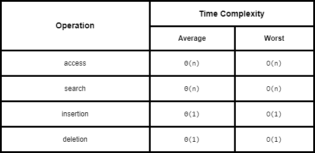

# Stacks

A **stack** is a collection of objects that are inserted and removed according to the **last-in, first-out (LIFO)** principle. Popular uses of stacks are for "back" and "undo" operations in browsers and editors.

In general the LIFO protocol allows the stack to be used as a tool for reversing a data sequence, matching tags, parenthesis etc.

Some common methods supported by a stack are:

- `stack.push(e)` - add an element `e` to the top of a stack
- `stack.pop()` - remove and return the top elements from a stack
- `stack.top()` - return the top element of a stack
- `stack.is_empty()` - check if stack is empty
- `len(stack)` - the number of elements in a stack

## Simple Array-Based Stacks

We can implements stacks easily by using a `list` in Python.

Look at [Adapter Pattern](../../Object%20Oriented%20Programming/adapter_pattern.ipynb) to get an example of a stack implementation using lists.

## Efficiencies

Space Complexity: `O(n)`

Time Complexities:

**References**
[^1]: Skiena, Steven S.. (2008). The Algorithm Design Manual, 2nd ed. (2). : Springer Publishing Company.
[^2]: Goodrich, M. T., Tamassia, R., & Goldwasser, M. H. (2013). Data Structures and Algorithms in Python (1st ed.). Wiley Publishing.
[^3]: Cormen, T. H., Leiserson, C. E., & Rivest, R. L. (1990). Introduction to algorithms. Cambridge, Mass. : New York, MIT Press.